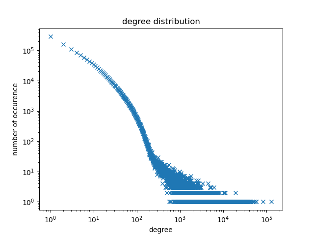
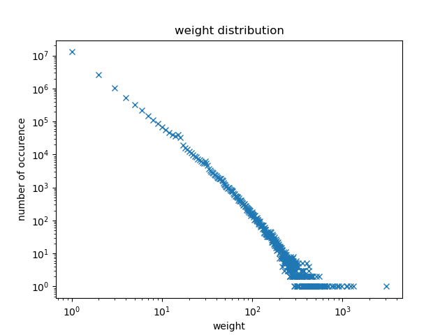
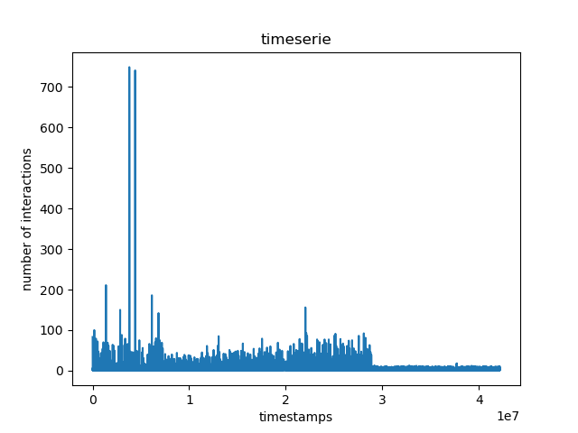

.. _peru:

Peru
====

* The Peru dataset is a multi-scale analysis of data associated with bank transactions involving credit and debit card in Peru during an extreme weather event.

* More details about the study and the dataset can be found in `Impact of natural disasters on consumer behavior: case ofthe 2017 El Ni ̃no phenomenon in Peru <https://arxiv.org/abs/2008.04887>`_.

* No data preparation was required for this dataset.

Plots
-----

   The degree distribution of the Peru dataset

   The weight distribution of the Peru dataset

   The timeserie of the Peru dataset

